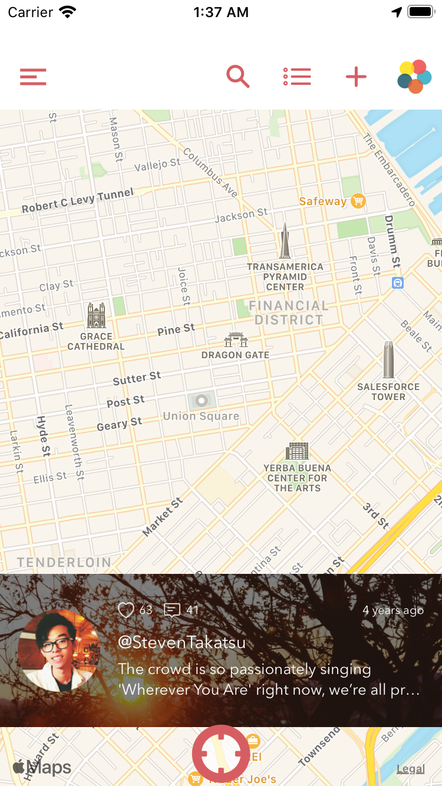
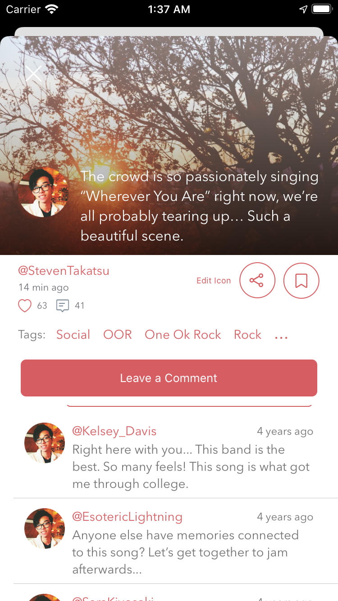
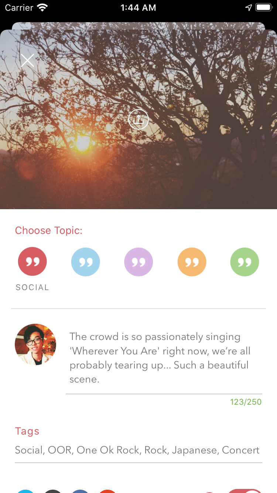
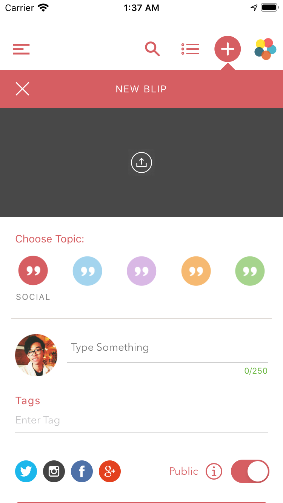
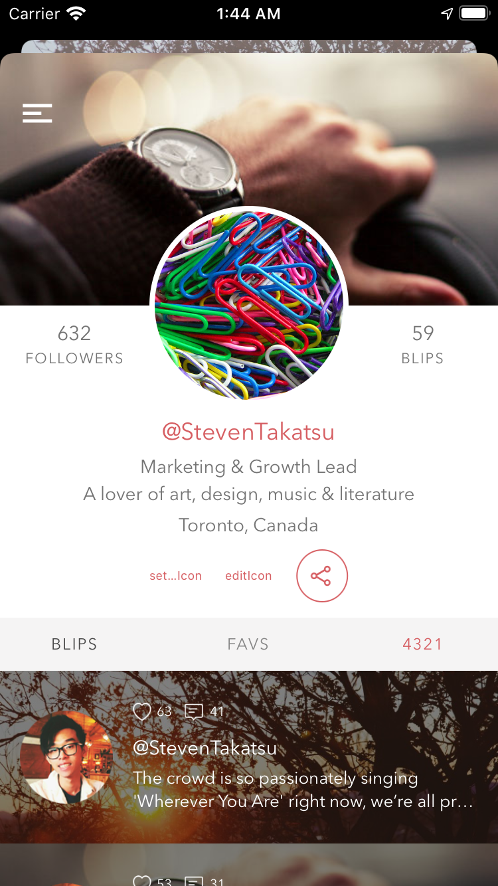
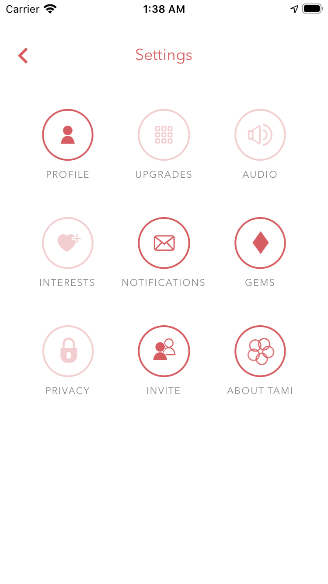
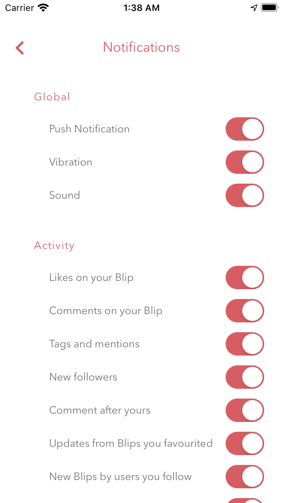
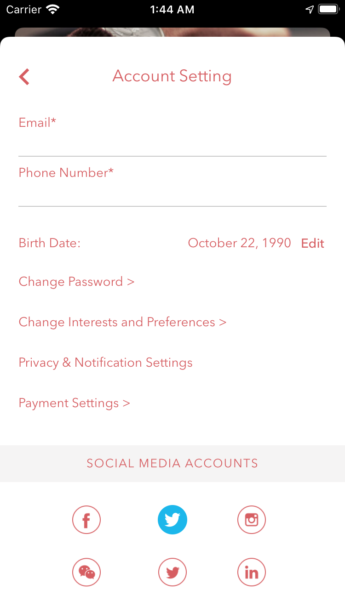

# Introduction

This miminum visible product was built independently by me as part of a contract with a client. The project was intended to be a food service for service for students. 

No UI design was provided, so I took inspirations from existing products on the market and previous projects.

# Technology

- Objective C
- CocoaPod
- XCode

# Screenshots

